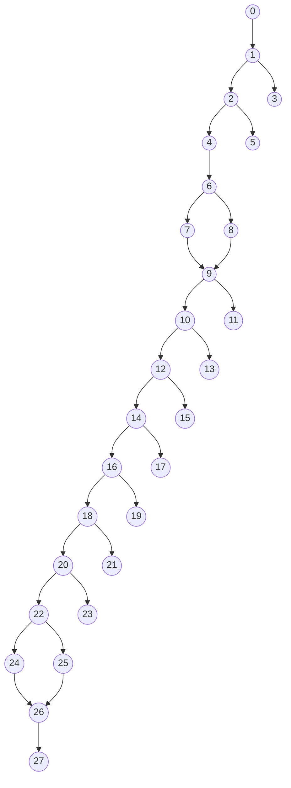

# Часть 1. Покрытие операторов для `POST /api/v1/chats` (`CreateChat`)

Источник: [chat_handler.go](/Users/niksa/projects/diploma/server/src/services/chat/presentation/handlers/chat_handler.go)

## Блок-схема операторов

```plantuml
@startuml
skinparam monochrome true
skinparam shadowing false
skinparam backgroundColor white
skinparam defaultFontName Arial
skinparam ArrowColor black
skinparam activityBorderColor black
skinparam activityBackgroundColor white
skinparam diamondBorderColor black
skinparam diamondBackgroundColor white

start

:S0 Вход в CreateChat;

if (D1 userID извлечен?) then (да)
else (нет)
  :S1\nВернуть 401\nuser ID not found;
  stop
endif

if (D2 JSON валиден?) then (да)
else (нет)
  :S2\nВернуть 400\nошибка bind;
  stop
endif

:S3\nTrimSpace(req.Name);

if (D3 WorkspaceExists вернул ошибку?) then (да)
  :S4\nВернуть 500\nfailed to check workspace;
  stop
else (нет)
endif

if (D4 Workspace exists?) then (да)
else (нет)
  :S5\nВернуть 404\nworkspace not found;
  stop
endif

if (D5 req.Type == 1 and req.Name == empty?) then (да)
  :S6\nreq.Name =\nPersonal chat;
else (нет)
endif

if (D6 req.Type != 1 and req.Name == empty?) then (да)
  :S7\nВернуть 400\nname is required\nfor non-personal chats;
  stop
else (нет)
endif

if (D7 req.Type == 1 and len(Members) != 2?) then (да)
  :S8\nВернуть 400\npersonal chat must have\nexactly 2 members;
  stop
else (нет)
endif

if (D8 Создатель уже в Members?) then (да)
else (нет)
  :S9\nДобавить создателя\nв Members;
endif

if (D9 Ошибка проверки membership создателя?) then (да)
  :S10\nВернуть 500\nfailed to check\nworkspace membership;
  stop
else (нет)
endif

if (D10 Создатель состоит в workspace?) then (да)
else (нет)
  :S11\nВернуть 403\nuser is not a member\nof this workspace;
  stop
endif

if (D11 Ошибка проверки любого участника?) then (да)
  :S12\nВернуть 500\nfailed to check\nworkspace membership;
  stop
else (нет)
endif

if (D12 Все участники состоят в workspace?) then (да)
else (нет)
  :S13\nВернуть 403\nsome users are not members\nof this workspace;
  stop
endif

if (D13 Ошибка CreateChat?) then (да)
  :S14\nВернуть 500\nошибка CreateChat;
  stop
else (нет)
endif

if (D14 Ошибка AddUserToChat?) then (да)
  :S15\nВернуть 500\nfailed to add member\nto chat;
  stop
else (нет)
endif

:S16\nВернуть 201\nchat created;
stop
@enduml
```

## Граф потока управления

Обозначения узлов графа потока управления:

- `0` начало выполнения метода
- `1` проверка `userID`
- `2` проверка `ShouldBindJSON`
- `3` возврат `401`
- `4` `TrimSpace(req.Name)`
- `5` возврат `400` после bind
- `6` проверка `WorkspaceExists` на ошибку
- `7` возврат `500` при ошибке `WorkspaceExists`
- `8` проверка существования workspace
- `9` проверка `req.Type == 1 && req.Name == ""`
- `10` присвоение `req.Name = "Personal chat"`
- `11` возврат `404`
- `12` проверка `req.Type != 1 && req.Name == ""`
- `13` проверка `req.Type == 1 && len(req.Members) != 2`
- `14` возврат `400` для non-personal без имени
- `15` возврат `400` для personal с неверным числом участников
- `16` проверка `creatorInMembers`
- `17` добавление создателя в `members`
- `18` проверка membership создателя на ошибку
- `19` возврат `500` при ошибке проверки создателя
- `20` проверка, что создатель состоит в workspace
- `21` возврат `403`, если создатель не состоит в workspace
- `22` проверка участника workspace на ошибку
- `23` возврат `500` при ошибке проверки участника
- `24` проверка, что участник состоит в workspace
- `25` возврат `403`, если участник не состоит в workspace
- `26` создание чата и добавление участников
- `27` завершение метода

## Обозначения операторов

- `S1` возврат `401`, если не удалось извлечь `userID`
- `S2` возврат `400`, если JSON не прошел `ShouldBindJSON`
- `S3` `req.Name = strings.TrimSpace(req.Name)`
- `S4` возврат `500`, если `WorkspaceExists` вернул ошибку
- `S5` возврат `404`, если workspace не найден
- `S6` автоподстановка имени `"Personal chat"`
- `S7` возврат `400`, если для non-personal чата имя пустое
- `S8` возврат `400`, если personal chat имеет не 2 участников
- `S9` автодобавление создателя в `members`
- `S10` возврат `500`, если ошибка при проверке membership создателя
- `S11` возврат `403`, если создатель не состоит в workspace
- `S12` возврат `500`, если ошибка при проверке любого участника
- `S13` возврат `403`, если хотя бы один участник не состоит в workspace
- `S14` возврат `500`, если `CreateChat` вернул ошибку
- `S15` возврат `500`, если `AddUserToChat` вернул ошибку
- `S16` возврат `201`, успешное создание чата

## Тест-кейсы для покрытия операторов

| № | Покрываемые операторы | Входные данные | Ожидаемый результат |
| --- | --- | --- | --- |
| 1 | `S1` | `header:` отсутствует `Authorization` и отсутствует `X-User-ID`  \n`json:` `{"name":"Team chat","type":2,"workspace_id":7,"members":[10,20]}` | `401 Unauthorized`  \n`{"error":"user ID not found"}` |
| 2 | `S2` | `header:` `Authorization: Bearer <jwt с user_id=10>`  \n`json:` `{}` | `400 Bad Request`  \nошибка валидации входного JSON |
| 3 | `S3, S4` | `header:` `Authorization: Bearer <jwt с user_id=10>`  \n`json:` `{"name":" Team chat ","type":2,"workspace_id":7,"members":[10,20]}`  \n`mocks:` `WorkspaceExists(7) -> error` | `500 Internal Server Error`  \n`{"error":"failed to check workspace"}` |
| 4 | `S3, S5` | `header:` `Authorization: Bearer <jwt с user_id=10>`  \n`json:` `{"name":" Team chat ","type":2,"workspace_id":7,"members":[10,20]}`  \n`mocks:` `WorkspaceExists(7) -> (false, nil)` | `404 Not Found`  \n`{"error":"workspace not found"}` |
| 5 | `S3, S7` | `header:` `Authorization: Bearer <jwt с user_id=10>`  \n`json:` `{"name":"","type":2,"workspace_id":7,"members":[10,20]}`  \n`mocks:` `WorkspaceExists(7) -> (true, nil)` | `400 Bad Request`  \n`{"error":"name is required for non-personal chats"}` |
| 6 | `S3, S6, S8` | `header:` `Authorization: Bearer <jwt с user_id=10>`  \n`json:` `{"name":"","type":1,"workspace_id":7,"members":[10]}`  \n`mocks:` `WorkspaceExists(7) -> (true, nil)` | `400 Bad Request`  \n`{"error":"personal chat must have exactly 2 members"}` |
| 7 | `S3, S6, S9, S16` | `header:` `Authorization: Bearer <jwt с user_id=10>`  \n`json:` `{"name":"","type":1,"workspace_id":7,"members":[20,21]}`  \n`mocks:` `WorkspaceExists(7) -> (true, nil)`  \n`IsUserInWorkspace(10,7) -> (true,nil)`  \n`IsUserInWorkspace(20,7) -> (true,nil)`  \n`IsUserInWorkspace(21,7) -> (true,nil)`  \n`IsUserInWorkspace(10,7) -> (true,nil)` при обходе участников после автодобавления  \n`CreateChat("Personal chat",1,7) -> chat{id:55,...}`  \n`AddUserToChat(55,20,1) -> nil`  \n`AddUserToChat(55,21,1) -> nil`  \n`AddUserToChat(55,10,2) -> nil` | `201 Created`  \nчат создан  \nимя автоматически стало `"Personal chat"`  \nсоздатель автоматически добавлен в список участников  \n`members_count = 3` |
| 8 | `S3, S10` | `header:` `Authorization: Bearer <jwt с user_id=10>`  \n`json:` `{"name":"Team chat","type":2,"workspace_id":7,"members":[10,20]}`  \n`mocks:` `WorkspaceExists(7) -> (true, nil)`  \n`IsUserInWorkspace(10,7) -> error` | `500 Internal Server Error`  \n`{"error":"failed to check workspace membership"}` |
| 9 | `S3, S11` | `header:` `Authorization: Bearer <jwt с user_id=10>`  \n`json:` `{"name":"Team chat","type":2,"workspace_id":7,"members":[10,20]}`  \n`mocks:` `WorkspaceExists(7) -> (true, nil)`  \n`IsUserInWorkspace(10,7) -> (false,nil)` | `403 Forbidden`  \n`{"error":"user is not a member of this workspace"}` |
| 10 | `S3, S12` | `header:` `Authorization: Bearer <jwt с user_id=10>`  \n`json:` `{"name":"Team chat","type":2,"workspace_id":7,"members":[10,20]}`  \n`mocks:` `WorkspaceExists(7) -> (true, nil)`  \n`IsUserInWorkspace(10,7) -> (true,nil)`  \n`IsUserInWorkspace(10,7) -> (true,nil)` при обходе участников  \n`IsUserInWorkspace(20,7) -> error` | `500 Internal Server Error`  \n`{"error":"failed to check workspace membership"}` |
| 11 | `S3, S13` | `header:` `Authorization: Bearer <jwt с user_id=10>`  \n`json:` `{"name":"Team chat","type":2,"workspace_id":7,"members":[10,20]}`  \n`mocks:` `WorkspaceExists(7) -> (true, nil)`  \n`IsUserInWorkspace(10,7) -> (true,nil)`  \n`IsUserInWorkspace(10,7) -> (true,nil)` при обходе участников  \n`IsUserInWorkspace(20,7) -> (false,nil)` | `403 Forbidden`  \n`{"error":"some users are not members of this workspace"}` |
| 12 | `S3, S14` | `header:` `Authorization: Bearer <jwt с user_id=10>`  \n`json:` `{"name":"Team chat","type":2,"workspace_id":7,"members":[10,20]}`  \n`mocks:` `WorkspaceExists(7) -> (true, nil)`  \n`IsUserInWorkspace(10,7) -> (true,nil)`  \n`IsUserInWorkspace(20,7) -> (true,nil)`  \n`CreateChat("Team chat",2,7) -> error` | `500 Internal Server Error`  \nтекст ошибки из `CreateChat` |
| 13 | `S3, S15` | `header:` `Authorization: Bearer <jwt с user_id=10>`  \n`json:` `{"name":"Team chat","type":2,"workspace_id":7,"members":[10,20]}`  \n`mocks:` `WorkspaceExists(7) -> (true, nil)`  \n`IsUserInWorkspace(10,7) -> (true,nil)`  \n`IsUserInWorkspace(20,7) -> (true,nil)`  \n`CreateChat("Team chat",2,7) -> chat{id:55,...}`  \n`AddUserToChat(55,10,2) -> nil`  \n`AddUserToChat(55,20,1) -> error` | `500 Internal Server Error`  \n`{"error":"failed to add member to chat"}` |

## Итог

- Набор тестов покрывает все исполняемые операторы `S1-S16`.
- Минимальный позитивный тест для успешной ветки: тест `7`.
- Тесты `3, 8, 10, 12, 13` являются white-box сценариями и требуют моков репозитория.
